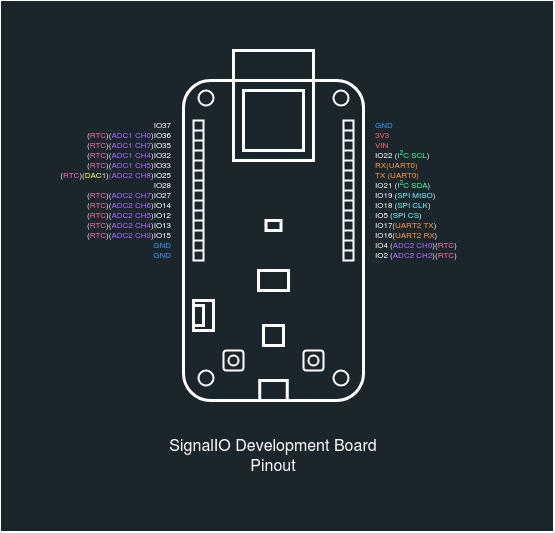
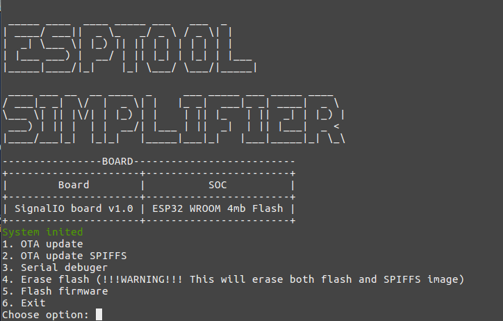
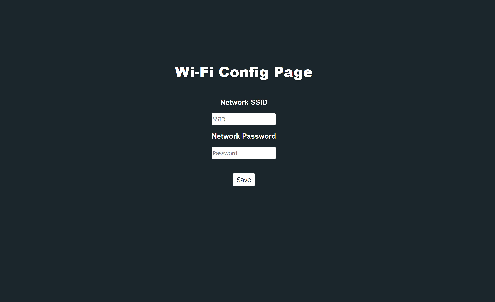
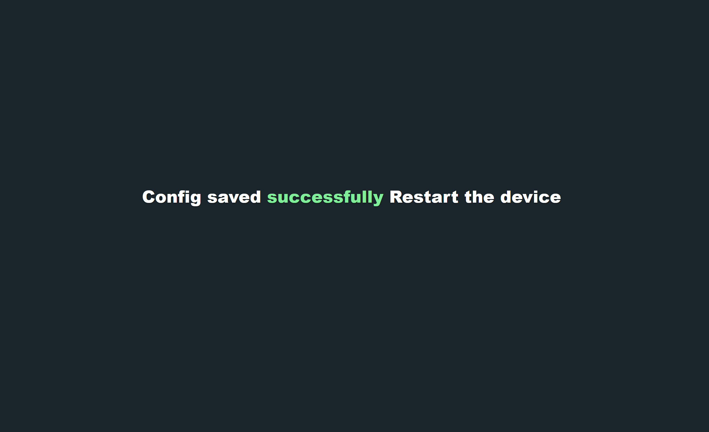
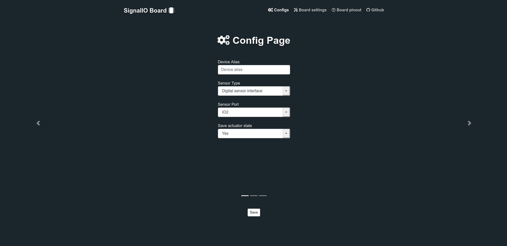
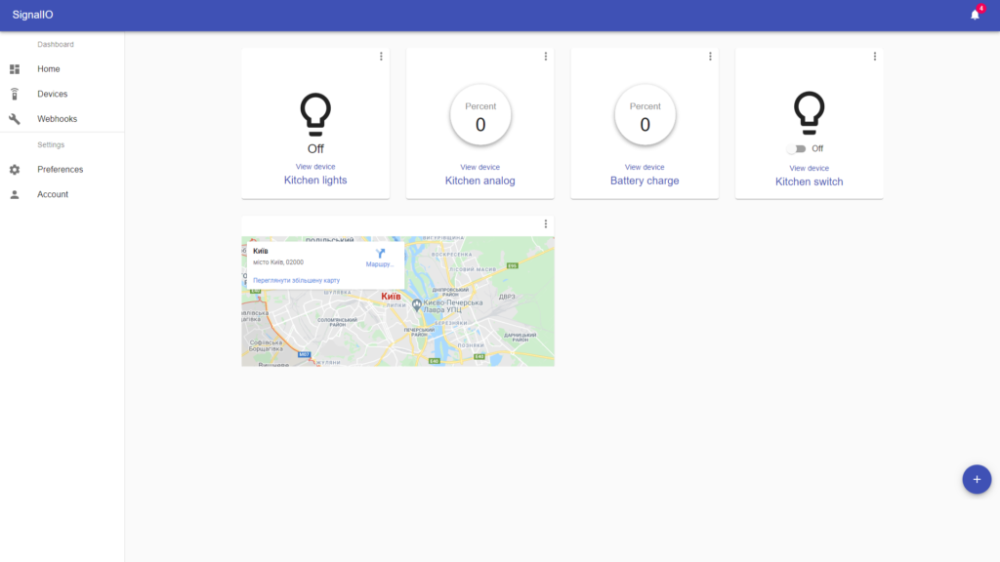
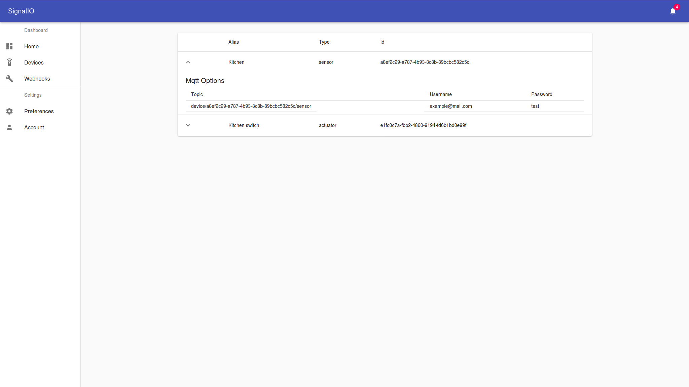
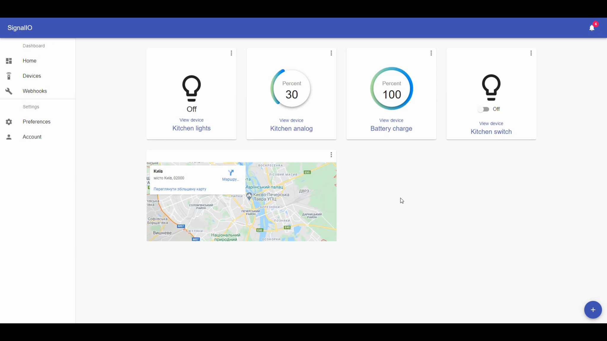

## Getting started with SignalIO Development Board


This documentation describes basic aspects of working with SignalIO Development Board and its firmware.
### SignalIO Board description

SignalIO Development Board is a device based on ESP32 SoC for IoT application development, hardware prototyping and design. SignalIO Development Board includes:
-	On-board USB-UART programmer
-	AMS 1117 3.3V 1A LDO
-	Battery charge level monitoring (resistive divider)
-	ESP32 WROOM SoC

The board is designed for non-professional users and is recommended for use in prototyping IoT systems, creating device concepts and learning programming and electronics. Improper use of the device can have unintended consequences for which the company is not responsible.

The board is based on a ESP32-WROOM SoC developed by Espressif with 40 nm technology. ESP32-WROOM integrates the following features:

-	Microcontroller: Tensilica 32-bit Single-/Dual-core CPU Xtensa LX6
-	Operating Voltage: 3.3V
-	DIO: 25
-	ADC: 6
-	DAC: 2
-	UARTs: 3
-	SPIs: 2
-	I2Cs: 3
-	I2Ss: 2
-	Flash Memory: 4 MB
-	SRAM: 520 KB
-	Clock Speed: 240 Mhz
-	Wi-Fi: IEEE 802.11 b/g/n/e/i, Bluetooth/BLE:
  -	Integrated TR switch, balun, LNA, power amplifier and matching network
  -	WEP or WPA/WPA2 authentication, or open networks
-	Special features:
  -	In-built Hall sensor
  -	In-built temperature sensor (internal temperature monitoring)
  -	Touch sensor interface 

More detailed information about SoC can be found on Espressif official documentation (https://www.espressif.com/sites/default/files/documentation/esp32_datasheet_en.pdf).

Device have 28 general purpose input/output (GPIO) pins. Most of it can be used as digital and analog I/O. Next picture illustrates pinmap diagram of the device.




### Firts Boot

After power is applied, the device will give a signal in the form of LED blinking with an interval of 0.5 seconds. When you start the device for the first time, you need to set up a Wi-Fi network connection. After turning on the power and initializing the interfaces, the device will enter the Wi-Fi access point mode, after connecting to the access point, the device will give access to the web interface for configuring Wi-Fi connections. After the Wi-Fi connection is established, the system will give access to the interface configuration menu and network interactions. When entering the configuration menu for the first time, the system will ask for a username and password. The standard login is Signalio_sensor, the password is root1234 (it is highly recommended to change it in the process of use). 

The device comes with two types of SignalIO proprietary firmware: 

- Basic firmware 
- OTA firmware 

Sometimes the device may come without firmware. In this case, the device must be flashed with the current firmware version using the SignalIO Simplified utility. The current firmware version can be obtained on the project's GIthub page - https://github.com/SignalIO-Team. 

### SignalIO-Simplify

SignalIO Simplify - simple utility for SignalIO Development Board. 
Its functions:

- OTA firmware and SPIFFS image update
- Upload firmware via USB-UART
- Serial port monitor
- Erase flash



This utility allows to upload new firmware and print debugging information into serial monitor. Firmware folder stores firmware.bin (can be redefined in config file) image, data folder stores spiffs.bin (can be redefined in config file) image and config folder stores config.json file.
JSON Config structure:

```json
{
  "port": "YourSerialPort",
  "port_speed": "9600",
  "ota_ip":"YourDeviceIP",
  "ota_password":"YourDevicePassword",
  "ota_username": "YourDeviceUsername",
  "firmware_path": "firmware/firmware.bin",
  "spiffs_path": "data/spiffs.bin",
  "flash":"4MB",
  "start_addr":"0x10000"
}
```

This software also require python 2.8^, esptool.py and some external libraries which is listed in requirements.txt file.

To start the utility use tis command:

Windows:
```
python __init__.py
```

Linux/Unix:

If you need to use serial debugger on Linux/Unix system you should also check if serial port available with command

```
ls /dev/tty*
```

Output should be: /dev/ttyUSB* or /dev/ttyACM*
You should also set ACL for the serial port with command

```
sudo chmod 777 /dev/ttyUSB*
```

Then you can run the utility
```
sudo python __init__.py
```

---
<span style="color:red">**NOTE**</span>

SignalIO Simplify Utility currently only been tested with Linux/Unix operation system. As an alternative to SignalIO Simplify, esptool can be used in the Windows system.

---

### Upload New Firmware via SignalIO-Simplify

There are two ways to flash a device using SignalIO Simplify: 
- Firmware with OTA update 
- Direct upload of the firmware as a binary file into the device memory (wrapper over esptool) 

In the first case, it is enough to configure the device in the firmware update mode in the settings item and select the OTA update option. The binary file located in the firmware folder will be loaded into the device memory after a while. For more information on OTA updates, see OTA Updates. In the case of uploading a binary file, the device must be connected directly to the PC. Next, select the Flash Firmware option, after which the firmware will be loaded into the device's memory. It should also be remembered that the firmware consists of two binary files: 

- Firmware.bin - the main firmware image; 
- SPIFFS.bin - an image of the SPIFFS file system with the files necessary for work.

---
<span style="color:red">**NOTE**</span>

At the first start, it is recommended to upload the firmware via Flash Firmware, as this will allow you to correctly mount the file system on the device. Alternatively, you can also use esptool.

---

### Debugging via UART with SignalIO-Simplify

To use serial debugger you need to connect the board to the PC and setup serial monitor. SignalIO development board allows user to debug it via UART in few ways.
First is to connect it directly via USB port. Second is to connect it with programmer with the TX and RX pins. This method can be used in case if inbuilt USB-UART prog In second case you need to use the USB-UART-TTL programmer. The RX TX pins of the programmer must be connected in accordance with the next scheme:

 Programmer pin  ----  Board pin
 
    TX       -->       RX            
    RX       -->       TX            
    GND      -->       GND           

After connecting the board to the PC, you need to configure the SignalIO Simplify utility by entering the necessary parameters in the config.json file, launch the utility and select the Serial debug option, after which debug information will appear in the port monitor. 

### Setup Wi-Fi connection

The Wi-Fi network is configured when the device is turned on for the first time. At the first start, the device will try to connect to the Wi-Fi network and if it fails, it will open the Wi-Fi manager.



Wi-Fi manager will scan existing Wi-Fi networks and display them on the monitor. After that, the manager will launch a local web server with a form for entering the SSID and password.

After entering and checking all the parameters, press the "SAVE" button. If the configuration has been saved in the device memory correctly, the following message will be displayed.



If an error occurs while saving the configuration, the following message will be displayed


After successful operation of setting up a Wi-Fi network, restart the device by pressing the “RST” button.

After rebooting, the device will automatically connect to the Wi-Fi network.
If you need to reset the existing Wi-Fi network settings, you can use the “FACTORY RESET” option by pressing the “FACT” button 


### Configuration menu



### SignalIO Web App Connetion







### Changing access credentials


### OTA Updates


