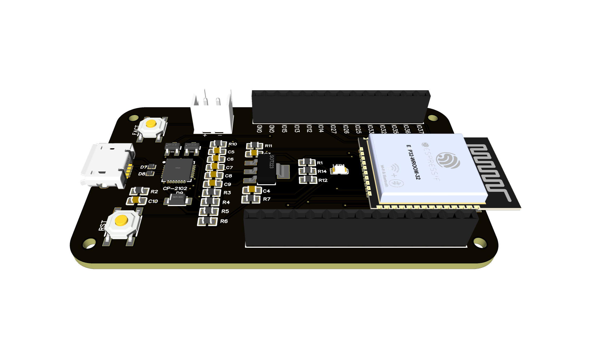

## SignalIO Development Board Documentation

This documentation describes basic aspects of working with SignalIO Development Board and its firmware.
### SignalIO Board description

SignalIO Development Board is a device based on ESP32 SoC for IoT application development, hardware prototyping and design. SignalIO Development Board includes:
-	On-board USB-UART programmer
-	AMS 1117 3.3V 1A LDO
-	Battery charge level monitoring (resistive divider)
-	ESP32 WROOM SoC

The board is designed for non-professional users and is recommended for use in prototyping IoT systems, creating device concepts and learning programming and electronics. Improper use of the device can have unintended consequences for which the company is not responsible.

The board is based on a ESP32-WROOM SoC developed by Espressif with 40 nm technology. ESP32-WROOM integrates the following features:

-	Microcontroller: Tensilica 32-bit Single-/Dual-core CPU Xtensa LX6
-	Operating Voltage: 3.3V
-	DIO: 25
-	ADC: 6
-	DAC: 2
-	UARTs: 3
-	SPIs: 2
-	I2Cs: 3
-	I2Ss: 2
-	Flash Memory: 4 MB
-	SRAM: 520 KB
-	Clock Speed: 240 Mhz
-	Wi-Fi: IEEE 802.11 b/g/n/e/i, Bluetooth/BLE:
  -	Integrated TR switch, balun, LNA, power amplifier and matching network
  -	WEP or WPA/WPA2 authentication, or open networks
-	Special features:
  -	In-built Hall sensor
  -	In-built temperature sensor (internal temperature monitoring)
  -	Touch sensor interface 

More detailed information about SoC can be found on Espressif official documentation (https://www.espressif.com/sites/default/files/documentation/esp32_datasheet_en.pdf).

### Firts Boot

Markdown is a lightweight and easy-to-use syntax for styling your writing. It includes conventions for

### SignalIO-Simplify

SignalIO Simplify - Simple utility for SignalIO Development Board Functions:

- OTA firmware and SPIFFS image update
- Upload firmware via USB-UART
- Serial port monitor
- Erase flash

### Upload New Firmware via SignalIO-Simplify

### Debugging via UART with SignalIO-Simplify

### Setup Wi-Fi connection

### Configuration menu

### SignalIO Web App Connetion

### Changing access credentials

### OTA Updates

